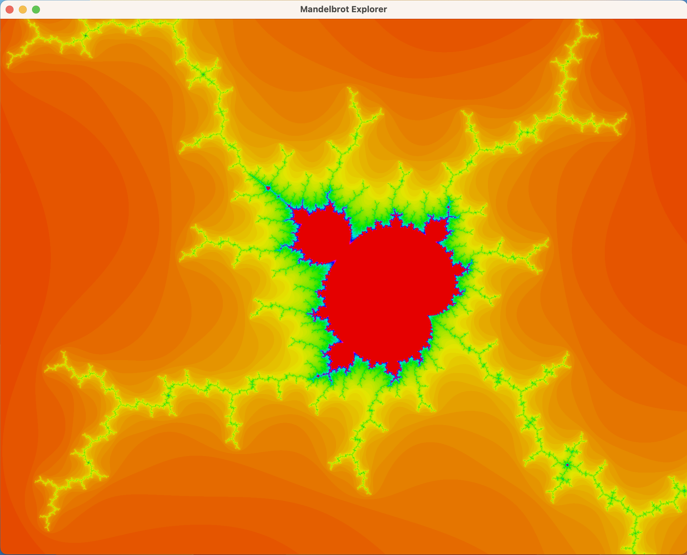

# almond-bread
Explorer for the Mandelbrot set written in C++ with GLFW3. 
The Mandelbrot set is the set of all points $z\in\mathbf{C}$ for which the series
$$ z_{n+1} = z_n^2 + c $$ with $c = 0$ is bounded, i.e., $z_n < \infty \forall n$. 
This explorer depicts

# Controls
| Key  | Action |
|------|--------|
| W / UP | Move up (positive imaginary direction) |
| S / DOWN | Move down (negative imaginary direction) |
| A / LEFT | Move left (negative real direction) |
| D / RIGHT | Move right (positive real direction) |
| Q / COMMA | Zoom in |
| E / PERIOD | Zoom out |
| R | Reset view |
| M | Increase number of maximum iterations by 10 |
| N | Decrease number of maximum iterations by 10 |
| C | Cycle through color schemes (currently 4 available) |
